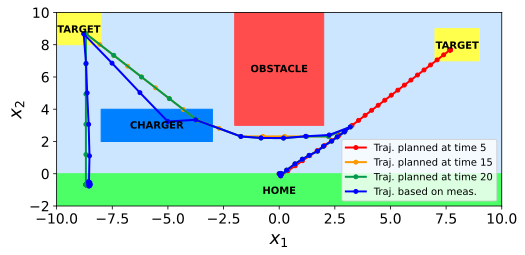

[](LICENSE)

# Risk-Aware MPC for Run-Time Temporal Logic (RaM-RutTL)

A Python library used to perform Model Predictive Control (MPC) for a single stochastic agent with Run-Time Temporal Logic.

## Quick Information

This library is used to facilitate the capability of robotic systems to execute dynamically assigned tasks with strict risk limitation.

### Scenario

This library considers an essential case handing scenario as follows, where a robot is required to:

- Start from `HOME`;
- Reach a `TARGET` on request;
- Reach the `CHARGER` on request;
- Visit `HOME` sufficiently often on request;
- Stay inside the work space.

`On request` means that the corresponding tasks are dynamically assigned without prior notice. The robot is required to accomplish these dynamically assigned tasks with a strict safety guarantee in a probability sense.

[](CASE)

### Associated Research Work

This library is associated with the Arxiv article in [https://arxiv.org/abs/2402.03165](https://arxiv.org/abs/2402.03165).

## Installation

### System Requirements

**Operating system**
 - *Windows* (compatible in general, successfully tested on 11)
 - *Linux* (compatible in general, successfully tested on 20.04)
 - *MacOS* (compatible in general)

**Python Environment**
 - Python version: `>=3.7` or `<=3.11`
 - **Recommended**: IDE ([VS code](https://code.visualstudio.com/) or [Pycharm](https://www.jetbrains.com/pycharm/)) and [Conda](https://www.anaconda.com/)
 - Required Packages: `numpy`, `treelib`, `gurobi`, `matplotlib`, `scipy`. 
 
### Quick Installation
 
1. Install conda following this [instruction](https://conda.io/projects/conda/en/latest/user-guide/install/index.html);

2. Open conda shell, create an independent project environment;
```
conda create --name ram-ruttl python=3.10
```

3. In the same shell, activate the created environment
```
conda activate ram-ruttl
```

4. In the same shell, within the `ram-ruttl` environment, install the dependencies one by one

```
conda install -c anaconda numpy
conda install -c conda-forge treelib
conda install -c gurobi gurobi
conda install -c conda-forge matplotlib
conda install -c anaconda scipy
```

**Toolbox stlpy**

This benchmark is based on the [stlpy](https://github.com/vincekurtz/stlpy/blob/main/README.md) toolbox. Please cite the source when you develop your own benchmark.

### Running Instructions

- Run the main script `main.py` to generate data in `/data`;
- Watch the terminal or check the logging file `/data/INFO.log` for the runtime information;
- Confirm that the data files `*.npy` are generated in `/data`;
- Run `plot.py` to plot the results, and yous should see a figure as above if successful; 
- The figures may impede each other; Drag the figures for a better view.

### Fine-Tuning the Code

Feel free to try out the code with different parameter settings in the `configs.py` file.

- Change the coordinates of the regions in the `RG` dictionary to construct a different map;
- Change the color map in the `CM` dictionary for preferred layout;
- Change the standard deviation variable `Sigma` for different noise levels;
- Change the initial position of the robot in `x0`;
- Customize the lists of runtime specifications `specs` and their instants `times` for various tasks.

## License

For the license of this library, refer to `LICENSE`.
